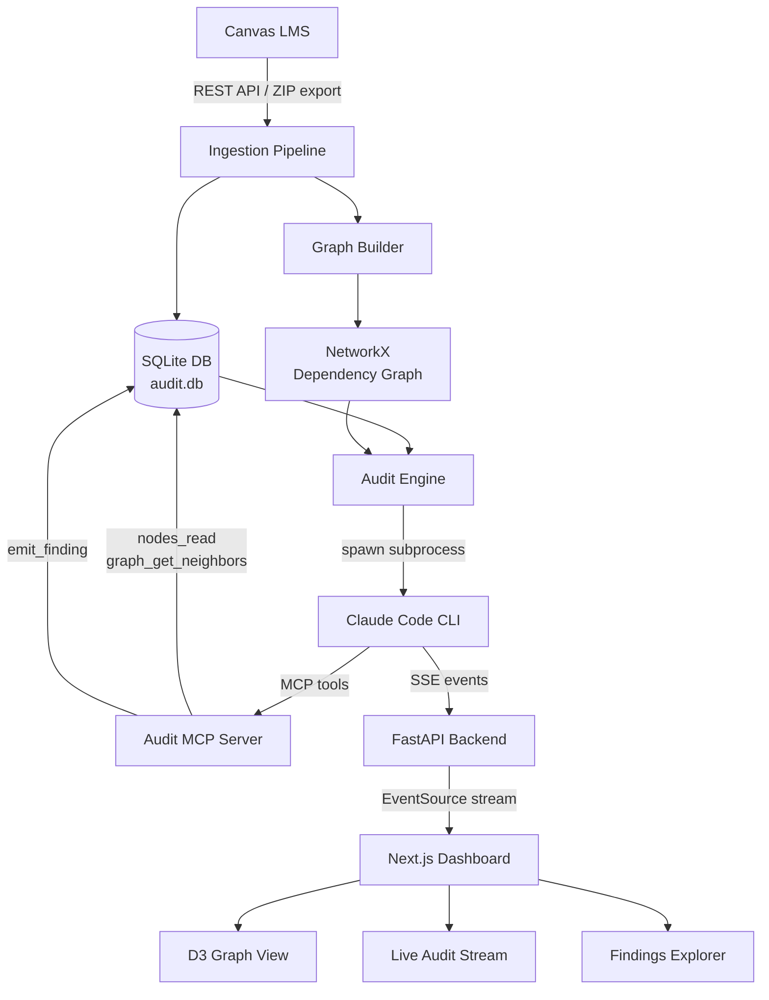
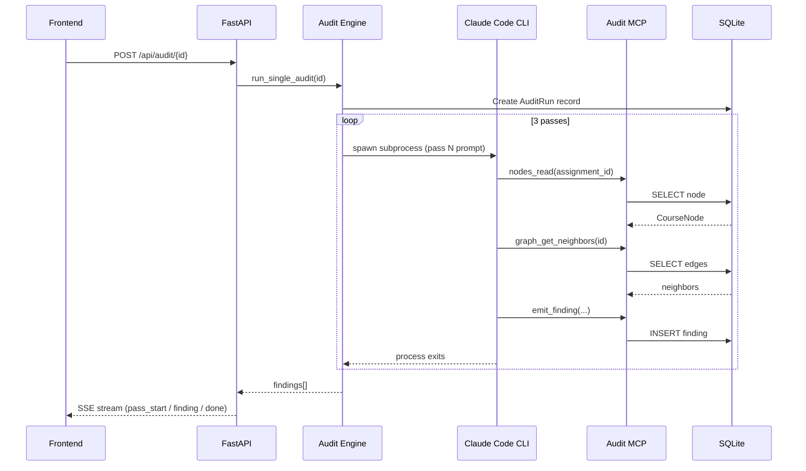
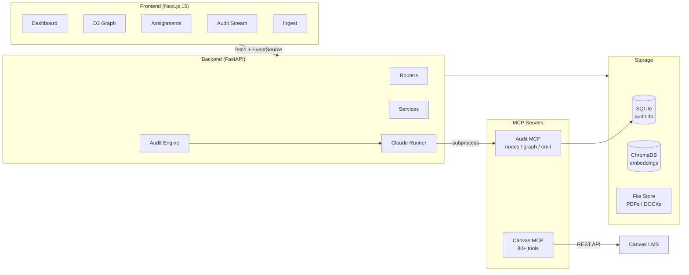
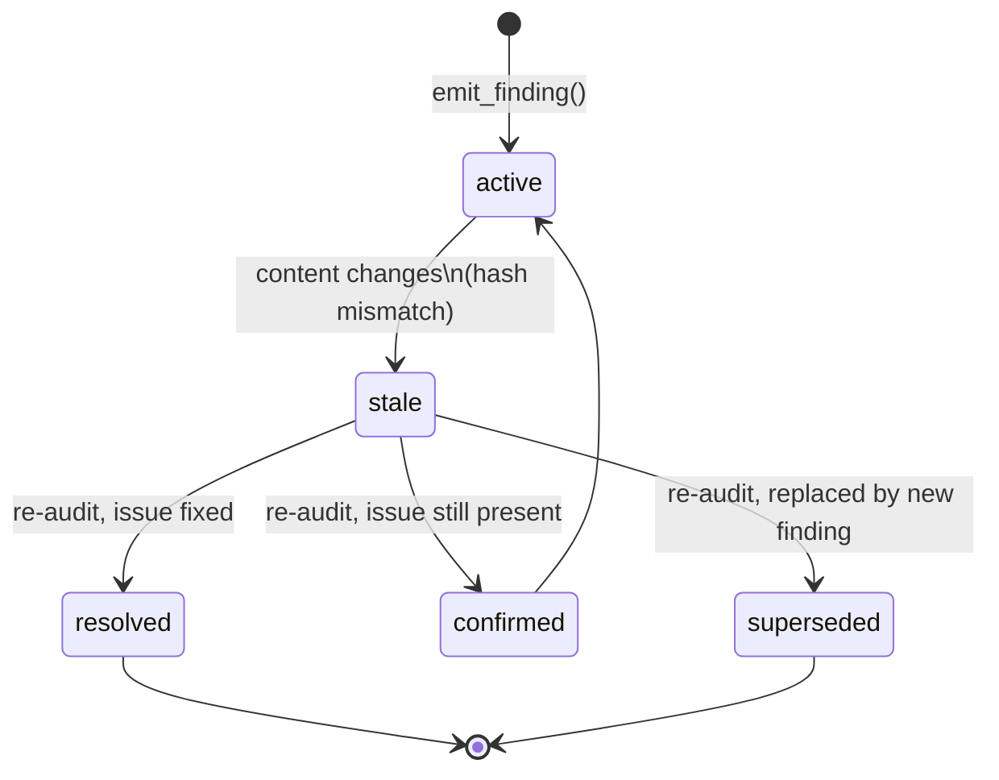

# CourseLens

> AI-powered course auditing for Canvas LMS. Ingest any course, derive a dependency graph, and run deep multi-pass AI reasoning to surface clarity issues, rubric mismatches, unstated prerequisites, and curriculum gaps — before your students find them.


---

## The Problem

Course design happens incrementally. An instructor writes an assignment, links a rubric, adds a handout, moves on. Reviewed in isolation, everything looks fine. But students experience the course in sequence — and that's where things break down:

- An assignment assumes knowledge that was never explicitly taught
- A rubric grades on criteria not mentioned anywhere in the instructions
- Week 5 produces output in one format; Week 8 expects a completely different one
- A three-week gap exists where a critical skill should have been introduced — but wasn't

**No one has a holistic view of the entire course at once — until now.**

---

## How It Works



### Step 1 — Ingest Everything

Connect to any Canvas course via API token and course ID. CourseLens pulls every assignment, rubric, page, lecture, announcement, and file. Each becomes a structured **node** in a local SQLite database with a SHA-256 content hash for change detection.

You can also ingest from a Canvas ZIP export (IMSCC format) for offline use.

### Step 2 — Build the Dependency Graph

The ingestion pipeline derives a **dependency graph** across all course content:

| Edge Type | Source |
|-----------|--------|
| `explicit` | HTML links parsed from assignment descriptions (`data-api-endpoint` attributes, `<a href>`) |
| `inferred` | Sequential module ordering (each item depends on the prior) |
| `artifact` | File output chains (Week 5 produces X → Week 8 consumes X) |
| `gap` | Missing connections detected during audit |

Orphan nodes (no incoming or outgoing edges) are flagged automatically.

### Step 3 — Run Deep AI Audits

For each assignment, CourseLens spawns a **Claude Code subprocess** and runs three reasoning passes:



| Pass | Focus | What it checks |
|------|-------|----------------|
| **Pass 1** | Standalone clarity | Ambiguous instructions, undefined terms, missing submission format, rubric-instruction mismatches, broken file references, unbalanced point weights |
| **Pass 2** | Backward dependencies | Unstated prerequisites, assumption gaps (relies on skills never taught), format mismatches with prior work, orphan detection |
| **Pass 3** | Forward impact | Cascade risks (fixing this breaks downstream), curriculum gaps, output/input incompatibilities between weeks |

Every finding **must quote specific text** as evidence — "could be clearer" is never acceptable.

### Step 4 — Fix and Re-Audit

When you fix content in Canvas:

1. Re-run ingestion to pull the updated content
2. Content hash comparison detects which nodes changed
3. Prior findings on changed nodes are automatically marked `stale`
4. Re-audit those nodes — findings are resolved, superseded, or confirmed

A living audit layer, not a one-time report.

---

## Architecture



### Tech Stack

| Layer | Technology |
|-------|-----------|
| AI Engine | Claude Code CLI (Max plan — zero per-audit API cost) |
| Backend | FastAPI + uvicorn + aiosqlite |
| Frontend | Next.js 15 (App Router) + Tailwind CSS v4 + shadcn/ui |
| Graph (backend) | NetworkX |
| Graph (frontend) | D3 v7 force-directed |
| Canvas integration | Canvas REST API (`canvasapi`) + Canvas MCP |
| State management | Zustand v5 |
| Database | SQLite with WAL mode + FK enforcement |
| Vector DB | ChromaDB (via official Chroma MCP) |
| Package manager | Bun |
| Testing | pytest + Vitest + Playwright |

---

## Quick Start

### Prerequisites

- **Python 3.11+**
- **[Bun](https://bun.sh)** — `curl -fsSL https://bun.sh/install | bash`
- **[uv](https://github.com/astral-sh/uv)** — `curl -LsSf https://astral.sh/uv/install.sh | sh`
- **[Claude Code CLI](https://docs.anthropic.com/en/docs/claude-code)** — authenticated on a Max plan (required for live audits; demo mode works without it)

### 1. Clone & Setup

```bash
git clone https://github.com/trevorflahardy/courselens
cd courselens

# Full automated setup (creates venv, installs deps, initializes DB, seeds demo data)
make setup
```

Or manually:

```bash
uv venv && source .venv/bin/activate
uv pip install -e ".[dev]"
python scripts/setup_db.py
python scripts/seed_demo.py
cd frontend && bun install && cd ..
```

### 2. Configure Your Canvas Course

Copy `.env.example` to `.env` and fill in your Canvas credentials:

```bash
cp .env.example .env
```

```dotenv
# .env
CANVAS_API_TOKEN=your_token_here        # Canvas → Account → Settings → New Access Token
CANVAS_API_URL=https://canvas.instructure.com/api/v1   # Your institution's Canvas URL
CANVAS_COURSE_ID=123456                 # Found in the course URL: /courses/{id}

# Defaults — change only if needed
DB_PATH=./data/audit.db
NEXT_PUBLIC_API_URL=http://localhost:8000
CORS_ORIGINS=http://localhost:3000
```

> **Finding your Canvas API token**: In Canvas, go to **Account → Settings → Approved Integrations → + New Access Token**

> **Finding your course ID**: Open any page inside your course. The URL will contain `/courses/XXXXXX` — that number is your course ID.

### 3. Run

```bash
make dev
```

This starts both the FastAPI backend (`:8000`) and the Next.js frontend (`:3000`) with hot reload.

Open [http://localhost:3000](http://localhost:3000)

---

## Demo Mode

No Canvas credentials? No Claude Code? No problem.

```bash
make seed    # Populate demo data (21 nodes, 20 edges, 8 pre-seeded findings)
make dev
```

The demo ships with a realistic course skeleton — assignments, pages, lectures, files, a full dependency graph, and pre-generated findings — so you can explore every feature without connecting to Canvas or running AI audits.

---

## Ingesting Your Course

Navigate to the **Ingest** page (`/ingest`) or use the API directly.

### Option A — Live Canvas Sync (recommended)

```bash
# Via the dashboard: Ingest → "Sync from Canvas"
# Or via API:
curl -X POST http://localhost:8000/api/ingest/course
```

This walks all modules, fetches full assignment/rubric/page content, extracts HTML links, and builds the dependency graph.

### Option B — Canvas ZIP Export

1. In Canvas: **Settings → Export Course Content → Course** → download the `.imscc` ZIP
2. In the dashboard: **Ingest → Upload ZIP**

```bash
curl -X POST http://localhost:8000/api/ingest/zip \
  -F "file=@course_export.imscc"
```

### After Ingesting

```bash
# Rebuild the dependency graph from extracted links
curl -X POST http://localhost:8000/api/ingest/rebuild-graph
```

---

## Running Audits

### Single Assignment

From the **Assignments** page, open any assignment and click **Run Audit**. Watch findings stream in real-time via the live audit view.

```bash
# Via API
curl -X POST http://localhost:8000/api/audit/{assignment_id}
# Then open the stream:
curl http://localhost:8000/api/audit/{run_id}/stream
```

### Audit Everything

```bash
# Dashboard: Audit → "Audit All"
# Or:
curl -X POST "http://localhost:8000/api/audit/all?batch_size=4"
```

Runs all assignments in week-sorted batches. Exceptions are caught per-assignment so one failure doesn't abort the batch.

### Course Summary

```bash
curl http://localhost:8000/api/audit/summary
```

Returns finding distributions by severity, type, and audit pass — useful for a high-level health report.

---

## Dashboard Pages

| Page | URL | Purpose |
|------|-----|---------|
| Dashboard | `/` | Live stats, severity breakdown, recent findings feed |
| Assignments | `/assignments` | Search + filter by type / severity / week, week-grouped cards |
| Assignment Detail | `/assignments/[id]` | Full content, rubric, findings grouped by pass with evidence quotes |
| Dependency Graph | `/graph` | Interactive D3 force-directed visualization of the course |
| Audit Controls | `/audit` | Audit All, run history, course summary panel |
| Live Audit | `/audit/[runId]` | 3-step pass stepper, animated finding cards via SSE |
| Ingestion | `/ingest` | ZIP upload, Canvas sync, graph rebuild, file triage |

---

## The Dependency Graph

The graph page visualizes every course element as a node positioned by **week on the Y-axis**. Nodes are color-coded by type (assignment, page, lecture, rubric, file, announcement) and carry a status ring (ok / warn / gap / orphan / unaudited).

**Filters:**
- **All** — full course graph
- **Gaps** — only nodes with `gap`-severity findings
- **Orphans** — disconnected nodes with no edges
- **Inferred** — show/hide inferred dependency edges
- **Connected** — hide isolated nodes

Click any node to open a detail panel. Hover to highlight its neighborhood and dim the rest.

---

## Finding Lifecycle



Findings are never silently deleted. When course content changes, the prior findings are marked `stale` and a re-audit determines their fate — so you always have a full audit trail.

---

## MCP Architecture

CourseLens uses three MCP servers:

| Server | Source | Tools |
|--------|--------|-------|
| **Audit MCP** | Custom (`audit_mcp/`) | 12 tools: `nodes_*`, `graph_*`, `emit_*` |
| **Canvas MCP** | Pre-installed | 80+ tools for course data access |
| **Chroma MCP** | Official (`chroma-mcp`) | Vector DB for semantic search |

The **Audit MCP** is what Claude Code calls during each audit pass — it's the only MCP server the AI subprocess is allowed to use. This keeps the audit sandboxed and the tool surface minimal.

```
nodes_read          — Fetch full node content
nodes_read_many     — Batch fetch multiple nodes
nodes_list          — List nodes with type/week/status filters
nodes_write         — Upsert node + recompute content hash
nodes_link          — Create node-to-node reference
nodes_get_stale     — Find nodes changed since last audit

graph_add_edge      — Add dependency edge
graph_get_neighbors — Get upstream + downstream neighbors
graph_get_flags     — Get all gap/orphan nodes
graph_mark_stale    — Mark edges for re-derivation

emit_finding        — Record a finding with evidence
emit_resolve_stale  — Resolve/confirm/supersede stale findings
```

---

## Project Structure

```
courselens/
├── backend/
│   ├── main.py              # FastAPI app, routers, lifespan
│   ├── config.py            # Pydantic Settings (.env loading)
│   ├── db.py                # aiosqlite connection management (WAL)
│   ├── claude_runner.py     # Subprocess spawner for Claude Code
│   ├── models/              # Pydantic v2 strict-mode data models
│   ├── routers/             # API route handlers (nodes, findings, graph, audit, ingest)
│   └── services/
│       ├── audit_engine.py  # 3-pass prompt builders + orchestration
│       ├── node_service.py  # Node CRUD + content_hash tracking
│       ├── graph_service.py # Edge CRUD + NetworkX integration
│       ├── finding_service.py
│       ├── file_service.py
│       ├── html_links.py    # Canvas HTML link extractor
│       └── ingest/
│           ├── canvas_live.py    # Live Canvas API ingestion
│           ├── canvas_sync.py    # Full course sync orchestration
│           ├── canvas_zip.py     # IMSCC ZIP parser
│           ├── graph_builder.py  # Dependency graph derivation
│           └── module_inference.py
│
├── audit_mcp/
│   └── audit_mcp.py         # Custom MCP server (FastMCP, 12 tools, 3 namespaces)
│
├── frontend/
│   ├── app/                 # Next.js App Router pages
│   ├── components/          # shadcn/ui + D3 graph + layout
│   ├── hooks/               # useAuditStream (SSE EventSource)
│   └── lib/                 # types.ts, api.ts, store.ts (Zustand)
│
├── scripts/
│   ├── setup_db.py          # SQLite schema initialization
│   ├── seed_demo.py         # Demo data (21 nodes, 20 edges, 8 findings)
│   └── setup.sh             # Automated first-time setup
│
├── tests/                   # pytest + Vitest + Playwright
├── data/                    # Generated — SQLite, ChromaDB, downloaded files
├── .mcp.json                # MCP server config
├── .env.example             # Environment variable template
├── Makefile                 # All common tasks
└── pyproject.toml           # Python deps + ruff + mypy config
```

---

## API Reference

### Nodes

```
GET    /api/nodes               ?type= &week= &status=
GET    /api/nodes/{id}
PATCH  /api/nodes/{id}
GET    /api/nodes/{id}/rubric
GET    /api/nodes/{id}/links
GET    /api/stats
```

### Audit

```
POST   /api/audit/{assignment_id}          Start audit → returns AuditRun
GET    /api/audit/{run_id}/stream          SSE stream of live findings
GET    /api/audit/runs                     List all audit runs
GET    /api/audit/runs/{run_id}            Single run status
POST   /api/audit/runs/{run_id}/cancel     Cancel running audit
POST   /api/audit/all          ?batch_size=4   Audit everything
GET    /api/audit/state                    Running audit count + IDs
GET    /api/audit/summary                  Course-level finding distributions
```

### SSE Event Format

```jsonc
{ "type": "pass_start", "data": { "pass": 1 } }
{ "type": "finding",    "data": { "id": "...", "severity": "gap", "title": "...", "body": "...", "evidence": "..." } }
{ "type": "pass_done",  "data": { "pass": 1, "findings": 3 } }
{ "type": "done",       "data": null }
{ "type": "error",      "data": { "message": "..." } }
```

### Graph

```
GET    /api/graph                          Full graph (nodes + edges)
GET    /api/graph/node/{id}               Neighborhood (upstream + downstream)
```

### Findings

```
GET    /api/findings              ?assignment_id= &severity=
GET    /api/findings/{assignment_id}
```

### Ingest

```
POST   /api/ingest/zip             Upload Canvas ZIP (multipart)
POST   /api/ingest/course          Sync live from Canvas
POST   /api/ingest/rebuild-graph   Rebuild edges from node_links
POST   /api/ingest/sync-rubrics    Fetch + link rubrics from Canvas
POST   /api/ingest/relink-content  Re-extract HTML links from all nodes
POST   /api/ingest/dedup-files     Merge duplicate file records
GET    /api/ingest/status          Current ingestion status
```

---

## Common Commands

```bash
make setup      # First-time setup (venv, deps, DB, demo data)
make dev        # Start backend (:8000) + frontend (:3000)
make seed       # Re-seed demo data
make test       # Run all tests (pytest + vitest)
make lint       # ruff + eslint
make check      # mypy + tsc type checking
make clean      # Remove generated data (DB, ChromaDB, files)
```

---

## Configuration Reference

All settings load from `.env` via Pydantic Settings:

| Variable | Default | Description |
|----------|---------|-------------|
| `CANVAS_API_TOKEN` | — | Canvas personal access token |
| `CANVAS_API_URL` | — | Base URL: `https://your.canvas.edu/api/v1` |
| `CANVAS_COURSE_ID` | — | Numeric course ID from the Canvas URL |
| `DB_PATH` | `./data/audit.db` | SQLite database path |
| `NEXT_PUBLIC_API_URL` | `http://localhost:8000` | Backend URL (used by frontend) |
| `CORS_ORIGINS` | `http://localhost:3000` | Allowed CORS origins |
| `DATA_DIR` | `./data` | Root data directory |

---

## Using With Any Canvas Course

CourseLens is not tied to any specific course. To point it at a different course:

1. Update `CANVAS_COURSE_ID` in `.env`
2. Run `make clean` to reset the database
3. Run `make setup` to reinitialize
4. Sync: `curl -X POST http://localhost:8000/api/ingest/course`
5. Build graph: `curl -X POST http://localhost:8000/api/ingest/rebuild-graph`
6. Audit: Dashboard → Audit → Audit All

The audit prompts are general-purpose — they work across STEM labs, lecture courses, professional programs, or any course that uses assignments, rubrics, and instructional pages.

---

## Documentation

| Document | Purpose |
|----------|---------|
| [APP.md](./APP.md) | Vision, problem statement, what gets caught |
| [ARCHITECTURE.md](./ARCHITECTURE.md) | Full technical architecture, data models, API design, all decisions |
| [PLAN.md](./PLAN.md) | Implementation phases, parallel streams, quality gates |
| [CLAUDE.md](./CLAUDE.md) | Instructions for the Claude Code AI orchestrator |

---

## License

MIT
